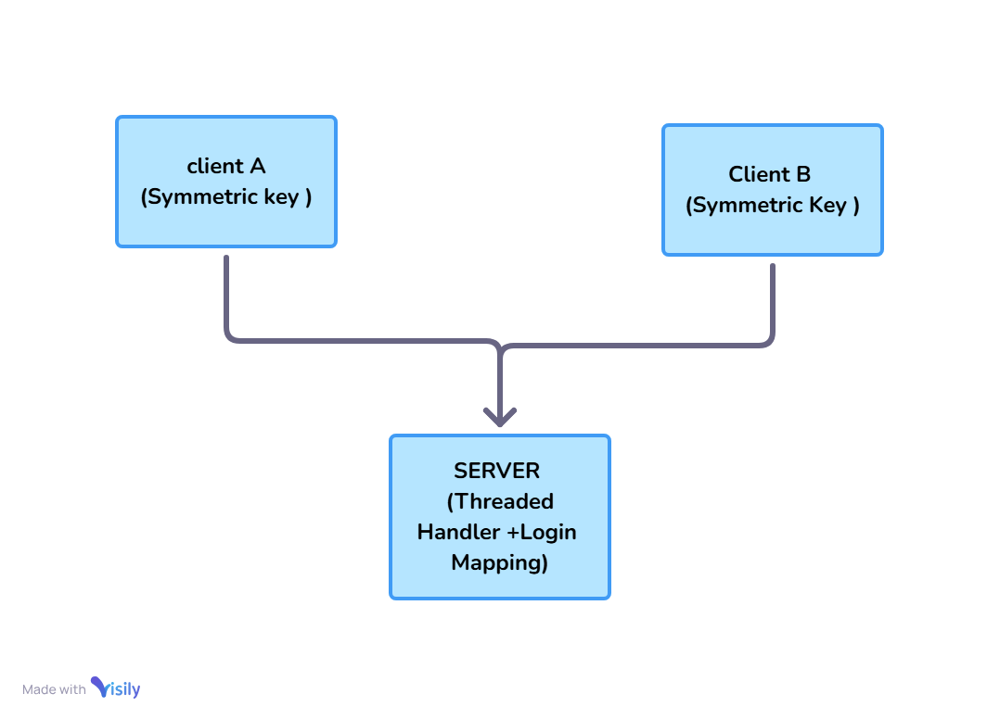

# 🔒 Terminal-Based Encrypted Chat Application

## Introduction
A **secure terminal-based chat application** that allows multiple users to communicate in real-time over a network. All messages are **end-to-end encrypted** using AES, ensuring only intended recipients can read them.

**Problem Statement:**  
Build a secure terminal-based chat system with encrypted messaging. Authentication should be performed at login using encrypted credentials.

---

## Key Constraints
1. Support **at least two concurrent users** with real-time messaging.  
2. Implement **end-to-end encryption** using a symmetric key algorithm (AES). Keys can be **pre-shared (hardcoded)**.  
3. Include **basic username/password authentication** at login.  
4. Use **colored text** in the terminal for improved readability.  

---

## Solution
The application allows encrypted communication between clients using pre-shared AES keys. Only authenticated users can participate. The **server acts as a relay**, forwarding encrypted messages without access to the plaintext. Login credentials are also encrypted using a separate symmetric key for secure authentication.

---

## High-Level Design

---

## Approach

### 🧑‍💻 Clients
- Each client has:
  - A **hardcoded symmetric AES key** for encrypting/decrypting messages between clients.  
  - A **unique symmetric key** shared with the server, used **only for login authentication**.  

### 🖥️ Server
- Stores all clients' **username:password pairs** encrypted with the respective login key.  
- Responsible for:
  - Decrypting login credentials.  
  - Verifying authentication.  
  - Managing threads for each client.  
  - Redirecting (not decrypting) messages between clients.  

---

## 🔐 Login Process
1. Client → Server: Sends `username:password` encrypted with the **login symmetric key**.  
2. Server → Decrypts & verifies credentials.  
3. On success → Server spawns a **thread** to handle client communication.  

---

## 💬 Messaging Process
1. **Client A** encrypts the message using the **client-to-client AES key**.  
2. Server forwards the encrypted message **without decryption**.  
3. **Client B** decrypts it using the same AES key.  
4. ✅ Only the intended client can read the message.  

---

## 🛠️ Implementation - Tech Stack

**Programming Language:** Python 3.x  

**Libraries & Modules:**  
- `socket` → Client-server communication  
- `threading` → Concurrent client handling  
- `cryptography` (AES/Fernet) → Message encryption & decryption  

**Encryption:**  
- AES for client-to-client messages  
- Symmetric key for client-server login authentication  

##Screen View

 

---

## 🧪 Testing

**Unit Testing Coverage:**  
- **AES Encryption/Decryption:** Verify correctness & payload integrity  
- **Login Authentication:** Validate proper handling of credentials  
- **Message Forwarding:** Ensure correct delivery across multi-threaded clients  
- **Error Handling:** Handle disconnects, invalid keys, and corrupted data gracefully  

---

## Deployment
The code is deployed on GitHub. Check out the application [here](https://github.com/your-username/your-repo-name).

---

## External Features
- **Chat Channel (Group Chat):** Allows multiple users to communicate together in a shared channel, sending and receiving messages in real-time.  

---

## 🚀 Application Running Steps (Compact)

1. **Clone Repo:** git clone [here](https://github.com/Geetanshi-jain/TerminalBasedChatApp)
2.  **Install Packages:** pip install -r requirements.txt
3. **Run Server:** python server.py (starts listening for clients)
4. **Run Clients:** python client.py (open multiple terminals, enter username & password)
5. **Start Chatting:** Choose Channel Chat / Direct Message / Point-to-Point Chat; messages are AES encrypted.
6. **Exit:** Type /exit in client or close terminal. beautyfiy this

